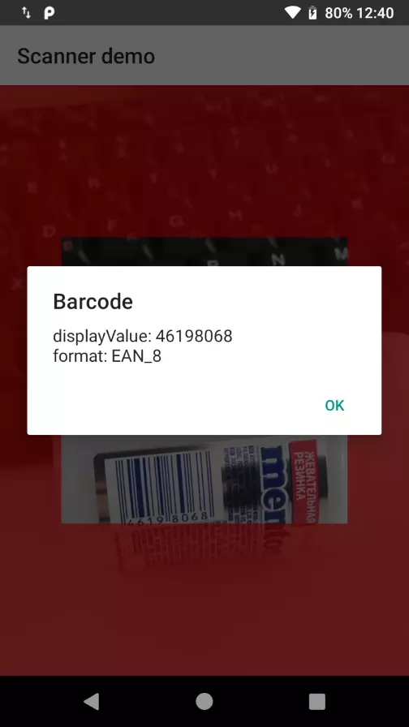

# Scanner

[](https://jitpack.io/#kakadu-dev/Scanner)
[](http://www.apache.org/licenses/LICENSE-2.0)

Fragment with camera preview, for scanning any barcode and QR-code.
This library uses [Google Mobile Vision](https://developers.google.com/vision/android/barcodes-overview) to detect barcode.



## Use:
Add the dependency in your `build.gradle` file:
```groovy
    repositories {
        maven { url "https://jitpack.io" }
}

    dependencies {
      implementation 'com.github.kakadu-dev:Scanner:LAST_VERSION'
 }
```

```kotlin
    class MainActivity : AppCompatActivity(), OnBarcodeDetectorListener {

        override fun onCreate(savedInstanceState: Bundle?) {
            super.onCreate(savedInstanceState)
            supportFragmentManager
                .beginTransaction()
                .replace(
                    android.R.id.content,
                    ScannerFragment.instance()
                )
                .commit()
        }

        override fun onBarcodeDetected(scanner: IScanner?, barcode: Barcode) {
            // do something with barcode
            scanner?.continueScan()
        }
    }
```
